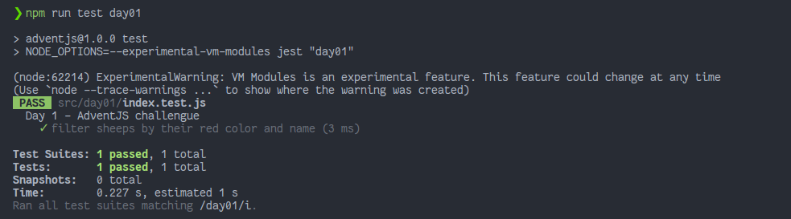

# Contando ovejas para dormir

> Con la emoción de que llega la navidad, nos está costando dormir bastante últimamente. Vamos a intentar usar este pequeño truco que nos ayudará a dormir más rápido 🐑.

### Solution

```javascript
export default function countSheeps(sheeps) {
  // aquí tu magia
  return sheeps.filter((sheep) => sheep.color === 'rojo' && sheep.name.toLowerCase().includes('na'))
}
```

### Test

```js
import countSheeps from './index'

describe('Day 1 - AdventJS challengue', () => {
  test('filter sheeps by their red color and name', () => {
    const sheeps = [
      { name: 'Noa', color: 'azul' },
      { name: 'Euge', color: 'rojo' },
      { name: 'Navidad', color: 'rojo' },
      { name: 'Ki Na Ma', color: 'rojo' },
    ]

    const result = [
      { name: 'Navidad', color: 'rojo' },
      { name: 'Ki Na Ma', color: 'rojo' },
    ]

    expect(countSheeps(sheeps)).toEqual(result)
  })
})
```

### Screenshot



[Back to the table of challengues](/README.md)
