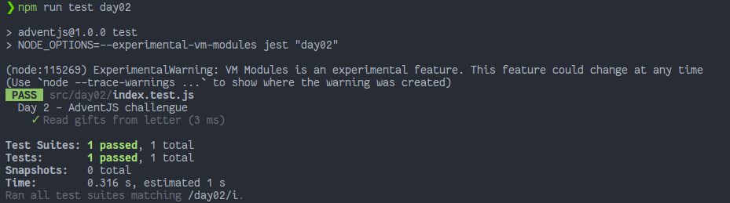

# ¡Ayuda al elfo a listar los regalos!

> ¡Menudo lío 😵! Un elfo está ayudando a Santa Claus. Pensaba que le vendría ya ordenado de cada regalo cuantas unidades debe conseguir... ¡y le ha llegado una carta ✉️! ¡Ayúdale!

### Solution

```javascript
export default function listGifts(letter) {
  // ¡Tú puedes!
  const words = letter
    .trim()
    .split(' ')
    .filter((w) => !w.startsWith('_'))

  const counter = words.reduce((acc, cur) => {
    if (!acc[cur]) acc[cur] = 1
    else acc[cur] += 1
    return acc
  }, {})
  return counter
}
```

### Test

```js
import listGifts from './index'

describe('Day 2 - AdventJS challengue', () => {
  test('Read gifts from letter', () => {
    const letter = 'bici coche balón _playstation bici coche peluche'
    const regalos = listGifts(letter)
    const result = {
      bici: 2,
      coche: 2,
      balón: 1,
      peluche: 1
    }

    expect(regalos).toEqual(result)
  })

  test('Read vowels and consonants from letter', () => {
    const letter = '_bici _ a m __ b c a b c'
    const regalos = listGifts(letter)
    const result = {
      a: 2,
      b: 2,
      c: 2,
      m: 1
    }

    expect(regalos).toEqual(result)
  })
})
```

### Screenshot



[Back to the table of challengues](/README.md)
