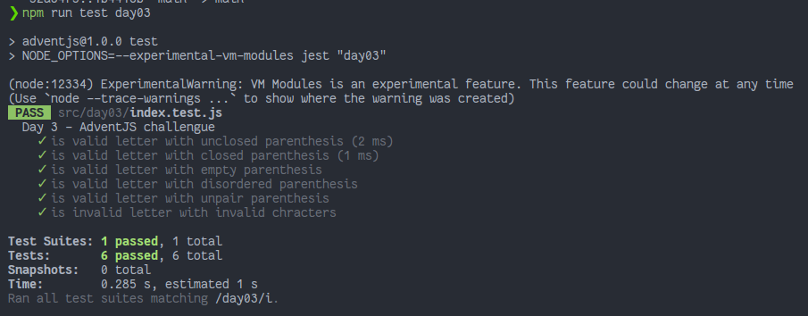

# El Grinch quiere fastidiar la Navidad

> ¡El Grinch anda suelto y quiere fastidiar la Navidad! 😱 Vamos a arreglar el lío que ha montado en la fábrica de regalos de Santa Claus

### Solution

```javascript
export default function isValid (letter) {
  // ¡No dejes que el Grinch gane!
  const char = letter.split('')
  const startChar = char.filter(l => l === '(').length
  const endChar = char.filter(l => l === ')').length

  if (startChar !== endChar) return false

  const words = letter.split(' ')
  const filteredWords = words
    .filter(w => !w.match(/\{\}\[\]/g) && !w.match(/\(\)/g))
    .map(w => w.replace(/\(\)/g, ''))

  return filteredWords.some(w => w.startsWith('(') && w.endsWith(')'))
}
```

### Test

```javascript
import isValid from './index'

describe('Day 3 - AdventJS challengue', () => {
  test('is valid letter with unclosed parenthesis', () => {
    expect(isValid('bici (balón bici coche')).toBeFalsy() // ❌
  })

  test('is valid letter with closed parenthesis', () => {
    expect(isValid('(muñeca) consola bici')).toBeTruthy() // ✅
    expect(isValid('a (b) (ca) d')).toBeTruthy() // ✅
  })

  test('is valid letter with empty parenthesis', () => {
    expect(isValid('() bici')).toBeFalsy() // ❌
    expect(isValid('(()) bici')).toBeFalsy() // ❌
  })

  test('is valid letter with disordered parenthesis', () => {
    expect(isValid(')bici( casa play')).toBeFalsy() // ❌
  })

  test('is valid letter with unpair parenthesis', () => {
    expect(isValid('(a() bici (a)')).toBeFalsy() // ❌
  })

  test('is invalid letter with invalid chracters', () => {
    expect(isValid('peluche {) bici')).toBeFalsy() // ❌
    expect(isValid('peluche }) bici')).toBeFalsy() // ❌
    expect(isValid('peluche [) bici')).toBeFalsy() // ❌
    expect(isValid('peluche ]) bici')).toBeFalsy() // ❌
  })
})

```

### Screenshot



[Back to the table of challengues](/README.md)
