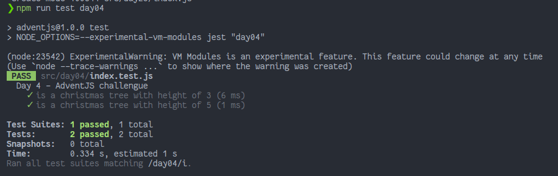

# ¡Es hora de poner la navidad en casa!

> Creo que ya podemos sacar el gorro navideño, el turrón... ¡Y el árbol de navidad! 🎄 Vamos a montarlo con JavaScript.

### Solution

```javascript
export default function createXmasTree (height) {
  // ¡Y no olvides también poner los turrones!

  const SNOWBALL = '*'
  const EMPTY = '_'
  const DECORATOR = '#'

  const formule = (n) => n + (n - 1)

  const generateArray = (_, index) => formule(index + 1)

  const createLine = (digits, line) => {
    const lastNDigits = line.slice(digits)
    const extractLine = lastNDigits.padEnd(line.length, EMPTY)

    const startNDigits = extractLine.slice(digits)
    return startNDigits.padStart(extractLine.length, EMPTY)
  }

  const createTree = (n, max) => {
    const digits = (max - n) / 2
    const line = SNOWBALL.repeat(max)
    return createLine(digits, line)
  }

  const createDecorator = (max) => {
    const digits = (max - 1) / 2
    const line = DECORATOR.repeat(max)
    return createLine(digits, line)
  }

  // define numbers and max line
  const numbers = Array.from({ length: height }, generateArray)
  const max = formule(numbers.length)

  // create line decorator
  const decorator = createDecorator(max)

  // create lines of tree
  const lines = numbers.map(n => createTree(n, max))

  // create tree
  const tree = [...lines, decorator, decorator]
  return tree.join('\n')
}

```

### Test

```js
import createXmasTree from "./index"

describe('Day 4 - AdventJS challengue', () => {
    test('is a christmas tree with height of 3', () => {
        expect(createXmasTree(3)).toBe(
            [
                '__*__',
                '_***_',
                '*****',
                '__#__',
                '__#__'
            ].join('\n')
        );
    })

    test('is a christmas tree with height of 5', () => {
        expect(createXmasTree(5)).toBe(
            [
                '____*____',
                '___***___',
                '__*****__',
                '_*******_',
                '*********',
                '____#____',
                '____#____',
            ].join('\n')
        )
    })

})
```

### Screenshot



[Back to the table of challengues](/README.md)
