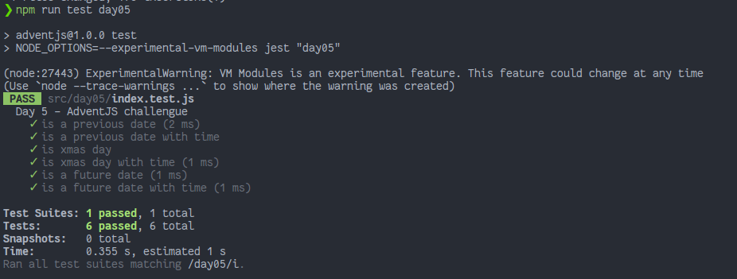

# Contando los días para los regalos

> ¡Qué ganas de abrir los regalos 🎁! Estoy tan nervioso que no paro de contar los días que faltan 🤣. ¿Me ayudas creando un programita? ¡Venga!

### Solution

```javascript
export default function daysToXmas(date) {
    // ¡Y no olvides compartir tu solución en redes!
    const ONE_DAY = 1000 * 60 * 60 * 24

    const christmasDay = new Date('Dec 25, 2021').getTime()

    const subtractedDays = christmasDay - date.getTime()

  	const days = Math.ceil(subtractedDays / ONE_DAY)
    
    return days === -0 ? Math.abs(days) : days
}
```

### Test

```javascript
import daysToXmas from "./index"

describe('Day 5 - AdventJS challengue', () => {
    test('is a previous date', () => {
        expect(daysToXmas(new Date('Dec 1, 2021'))).toBe(24)
        expect(daysToXmas(new Date('Dec 24, 2021'))).toBe(1)
      })
    
      test('is a previous date with time', () => {
        expect(daysToXmas(new Date('Dec 1, 2021 00:00:01'))).toBe(24)
        expect(daysToXmas(new Date('Dec 1, 2021 23:59:59'))).toBe(24)
        expect(daysToXmas(new Date('Dec 24, 2021 00:00:01'))).toBe(1)
        expect(daysToXmas(new Date('Dec 24, 2021 23:59:59'))).toBe(1)
      })
    
      test('is xmas day', () => {
        expect(daysToXmas(new Date('Dec 25, 2021'))).toBe(0)
      })
    
      test('is xmas day with time', () => {
        expect(daysToXmas(new Date('Dec 25, 2021 00:00:01'))).toBe(0)
        expect(daysToXmas(new Date('Dec 25, 2021 23:59:59'))).toBe(0)
      })
    
      test('is a future date', () => {
        expect(daysToXmas(new Date('Dec 26, 2021'))).toBe(-1)
        expect(daysToXmas(new Date('Dec 31, 2021'))).toBe(-6)
        expect(daysToXmas(new Date('Jan 1, 2022'))).toBe(-7)
      })
    
      test('is a future date with time', () => {
        expect(daysToXmas(new Date('Dec 26, 2021 00:00:01'))).toBe(-1)
        expect(daysToXmas(new Date('Dec 26, 2021 23:59:59'))).toBe(-1)
        expect(daysToXmas(new Date('Dec 31, 2021 00:00:01'))).toBe(-6)
        expect(daysToXmas(new Date('Dec 31, 2021 23:59:59'))).toBe(-6)
        expect(daysToXmas(new Date('Jan 1, 2022 00:00:01'))).toBe(-7)
        expect(daysToXmas(new Date('Jan 1, 2022 23:59:59'))).toBe(-7)
      })

})
```

### Screenshot



[Back to the table of challengues](/README.md)
