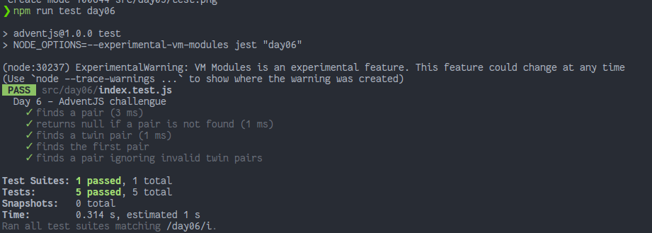

# Rematando los exámenes finales

> Buffff! Ya huelo las vacaciones pero todavía falta terminar los exámenes finales. ¡Y toca un poco de matemáticas! 😱 ¡Ayúdame!

### Solution

```javascript
export default function sumPairs(numbers, result) {
    // ¡Y no olvides compartir tu solución en redes!

    const lastIndex = numbers.length - 1;
    const map = new Map()

    for (const [index1, firstNumber] of numbers.entries()) {
        if (lastIndex === index1) break;

        for (const [index2, secondNumber] of numbers.entries()) {
            if (index1 === index2) continue;
            if (map.has('pairs')) break;

            const sum = firstNumber + secondNumber;
            if (sum === result) {
                map.set('pairs', [firstNumber, secondNumber])
                break;
            }
        }
    }
    return map.get('pairs') || null
}
```

### Test

```javascript
import sumPairs from "./index"

describe('Day 6 - AdventJS challengue', () => {
  test('finds a pair', () => {
    expect(sumPairs([3, 5, 7, 2], 10)).toEqual([3, 7])
  })

  test('returns null if a pair is not found', () => {
    expect(sumPairs([-3, -2, 7, -5], 10)).toEqual(null)
  })

  test('finds a twin pair', () => {
    expect(sumPairs([2, 2, 3, 1], 4)).toEqual([2, 2])
  })

  test('finds the first pair', () => {
    expect(sumPairs([6, 7, 1, 2], 8)).toEqual([6, 2])
  })

  test('finds a pair ignoring invalid twin pairs', () => {
    expect(sumPairs([0, 2, 2, 3, -1, 1, 5], 6)).toEqual([1, 5])
  })
})
```

### Screenshot



[Back to the table of challengues](/README.md)
