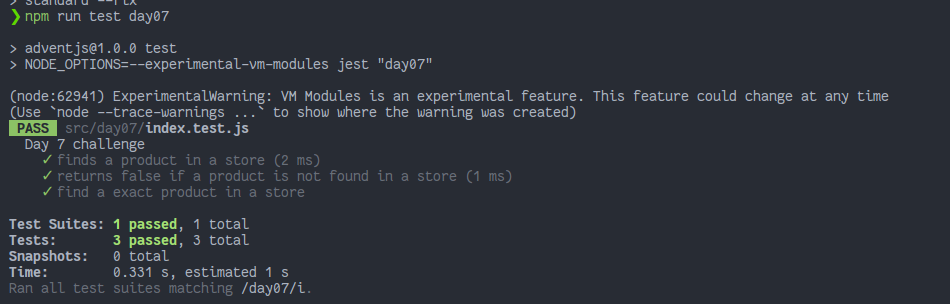

# Buscando en el almacén...

> Tenemos un amigo que trabaja en una tienda y no es capaz de encontrar en el almacén los productos que tiene... ¿Le ayudamos?

### Solution

```javascript
export default function contains (store, product) {
  // ¡Y no olvides compartir tu solución en redes!

  const getListOfProduct = (list) =>
    list.flatMap((item) => {
      if (typeof item === 'object') {
        return getListOfProduct(Object.values(item))
      }
      return item
    })

  const listOfProducts = getListOfProduct(Object.values(store))

  return listOfProducts.some((item) => item === product)
}
```

### Test

```javascript
import contains from './index'

describe('Day 7 challenge', () => {
  test('finds a product in a store', () => {
    const store = {
      estanteria1: {
        cajon1: {
          producto1: 'coca-cola',
          producto2: 'fanta',
          producto3: 'sprite'
        }
      },
      estanteria2: {
        cajon1: 'vacio',
        cajon2: {
          producto1: 'pantalones',
          producto2: 'camiseta'
        }
      }
    }

    expect(contains(store, 'camiseta')).toBeTruthy()
  })

  test('returns false if a product is not found in a store', () => {
    const store = {
      baul: {
        fondo: {
          objeto: 'cd-rom',
          'otro-objeto': 'disquette',
          'otra-cosa': 'mando'
        }
      }
    }

    expect(contains(store, 'gameboy')).toBeFalsy()
  })

  test('find a exact product in a store', () => {
    const store = {
      a: {
        b: {
          c: {
            d: {
              e: 'fa'
            }
          }
        }
      }
    }

    expect(contains(store, 'f')).toBeFalsy()
  })
})
```

### Screenshot



[Back to the table of challengues](/README.md)
