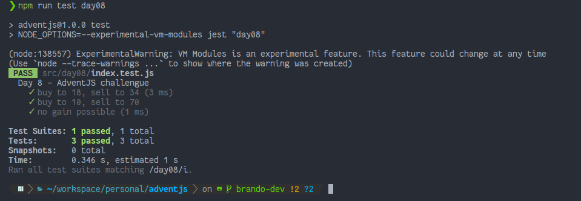

# La locura de las criptomonedas

> Hemos invertido en criptomonedas... Y el otro día se pusieron todos los valores en rojo. En lugar de asustarnos, vamos a ver si podemos optimizar nuevas inversiones.

### Solution

```javascript
export default function maxProfit (prices) {
  // ¡Y no olvides compartir tu solución en redes!
  const lastIndex = prices.length - 1
  let gains = []

  for (const [index1, firstNumber] of prices.entries()) {
    if (lastIndex === index1) break

    for (const [index2, secondNumber] of prices.entries()) {
      if (index1 === index2) continue
      if (index1 >= index2) continue
      if (firstNumber >= secondNumber) continue

      const gain = secondNumber - firstNumber
      gains = [...gains, gain]
    }
  }

  const max = gains.length === 0 ? -1 : Math.max(...gains)
  return max
}

```

### Test

```javascript
import maxProfit from './index'

describe('Day 8 - AdventJS challengue', () => {
  test('buy to 18, sell to 34', () => {
    expect(maxProfit([39, 18, 29, 25, 34, 32, 5])).toEqual(16)
  })

  test('buy to 10, sell to 70', () => {
    expect(maxProfit([10, 20, 30, 40, 50, 60, 70])).toEqual(60)
  })

  test('no gain possible', () => {
    expect(maxProfit([18, 15, 12, 11, 9, 7])).toEqual(-1)
    expect(maxProfit([3, 3, 3, 3, 3])).toEqual(-1)
  })
})
```

### Screenshot



[Back to the table of challengues](/README.md)
