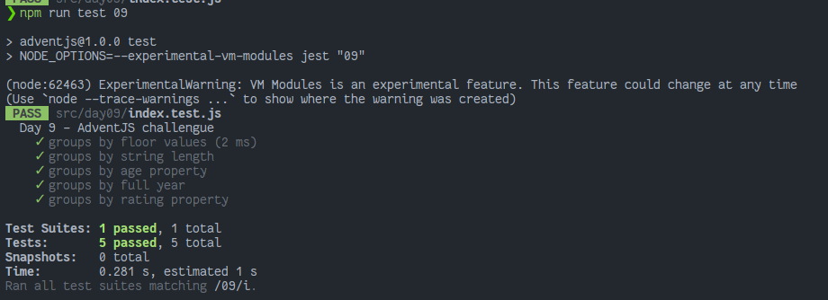

# Agrupando cosas automáticamente

> Tenemos un montón de cajas en la fábrica de regalos... y como no automaticemos de alguna forma ordenar este desastre... ¡Igual nos quedamos sin Navidad!

### Solution

```javascript
export default function groupBy(collection, it) {
  // ¡No olvides compartir tu solución en redes!
  // console.log({ collection, it })

  return collection.reduce((result, current) => {
    const value = typeof it === 'string' ? current[it] : it(current)
    if (result[value] === undefined) result[value] = []

    result[value] = [...result[value], current]
    return result
  }, {})
}
```

### Test

```javascript
import groupBy from './index'

const cases = [
  {
    title: 'groups by floor values',
    collection: [6.1, 4.2, 6.3],
    it: Math.floor,
    expected: { 6: [6.1, 6.3], 4: [4.2] },
  },
  {
    title: 'groups by string length',
    collection: ['one', 'two', 'three'],
    it: 'length',
    expected: { 3: ['one', 'two'], 5: ['three'] },
  },
  {
    title: 'groups by age property',
    collection: [{ age: 23 }, { age: 24 }],
    it: 'age',
    expected: { 23: [{ age: 23 }], 24: [{ age: 24 }] },
  },
  {
    title: 'groups by full year',
    collection: [1397639141184, 1363223700000],
    it: (/** @type {number} */ timestamp) => new Date(timestamp).getFullYear(),
    expected: { 2013: [1363223700000], 2014: [1397639141184] },
  },
  {
    title: 'groups by rating property',
    collection: [
      { title: 'JavaScript: The Good Parts', rating: 8 },
      { title: 'Aprendiendo Git', rating: 10 },
      { title: 'Clean Code', rating: 9 },
    ],
    it: 'rating',
    expected: {
      8: [{ title: 'JavaScript: The Good Parts', rating: 8 }],
      9: [{ title: 'Clean Code', rating: 9 }],
      10: [{ title: 'Aprendiendo Git', rating: 10 }],
    },
  },
]

describe('Day 9 - AdventJS challengue', () => {
  test.each(cases)('$title', ({ collection, it, expected }) => {
    expect(groupBy(collection, it)).toEqual(expected)
  })
})
```

### Screenshot



[Back to the table of challengues](/README.md)
