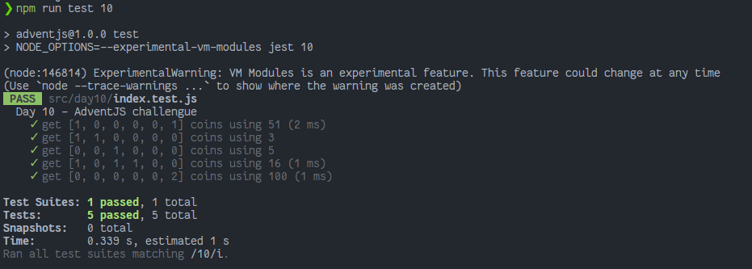

# La máquina de cambio

> De cara a las ventas navideñas, vamos a automatizar el cambio de las monedas para que no se tenga que hacer manualmente. ¡Ganaremos tiempo! Pero primero, hay que programarlo.

### Solution

```javascript
export default function getCoins (change) {
  // ¡No olvides compartir tu solución en redes!
  let remainder = null
  const INITIAL_VALUE = [0, 0, 0, 0, 0, 0]
  const CENTS = [50, 20, 10, 5, 2, 1]

  return CENTS.reduce((result, currentValue, currentIndex) => {
    if (remainder === null) remainder = change

    if (remainder >= currentValue) {
      result[currentIndex] = Math.floor(remainder / currentValue)
      remainder = remainder % currentValue
    }
    return result
  }, INITIAL_VALUE).reverse()
}
```

### Test

```javascript
import getCoins from './index'

const cases = [
  { input: 51, expected: [1, 0, 0, 0, 0, 1] },
  { input: 3, expected: [1, 1, 0, 0, 0, 0] },
  { input: 5, expected: [0, 0, 1, 0, 0, 0] },
  { input: 16, expected: [1, 0, 1, 1, 0, 0] },
  { input: 100, expected: [0, 0, 0, 0, 0, 2] }
]

describe('Day 10 - AdventJS challengue', () => {
  test.each(cases)('get $expected coins using $input', ({ input, expected }) => {
    expect(getCoins(input)).toEqual(expected)
  })
})
```

### Screenshot



[Back to the table of challengues](/README.md)
