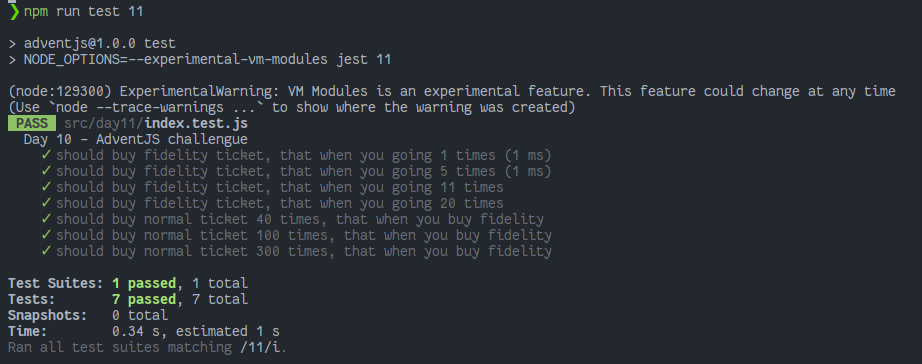

# ¿Vale la pena la tarjeta fidelidad del cine?

> ¡Este mes hay un montón de peliculones en el cine! Viendo que voy a tener que pasar bastante por taquilla también en 2022, estoy mirando de optimizar mis gastos. ¡Ayúdame!

### Solution

```javascript
export default function shouldBuyFidelity (times) {
  // ¡No olvides compartir tu solución en redes!
  const TICKET_COST = 12
  const BUY_NORMAL = TICKET_COST * times

  const INIT_FIDELITY_COST = 250
  const TICKET_DISCOUNT = 0.75
  const INIT_VALUE = 0
  const REMAINDER_FIDELITY_COST = Array.from({ length: times }).reduce(
    (result, _, currentIndex) => result + TICKET_COST * Math.pow(TICKET_DISCOUNT, currentIndex + 1),
    INIT_VALUE
  )
  const BUY_FIDELITY = INIT_FIDELITY_COST + REMAINDER_FIDELITY_COST
  return BUY_FIDELITY < BUY_NORMAL
}
```

### Test

```javascript
import shouldBuyFidelity from './index'

describe('Day 10 - AdventJS challengue', () => {
  test.each([1, 5, 11, 20])('should buy fidelity ticket, that when you going %i times', (input) => {
    expect(shouldBuyFidelity(input)).toBeFalsy()
  })

  test.each([40, 100, 300])('should buy normal ticket %i times, that when you buy fidelity', (input) => {
    expect(shouldBuyFidelity(input)).toBeTruthy()
  })
})
```

### Screenshot



[Back to the table of challengues](/README.md)
