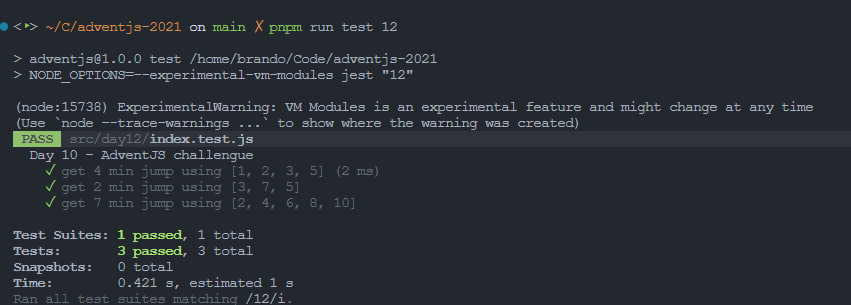

# La ruta perfecta para dejar los regalos

> En el taller de Santa ya están preparándolo todo para poder hacer la ruta perfecta para dejar los regalos. El problema es que hay unos obstáculos en el camino que debemos sortear...

### Solution

```javascript
export default function getMinJump (obstacles) {
  // reorder list
  const list = obstacles.sort((a, b) => a - b)

  // jump list
  const max = Math.max(...obstacles)
  const jumps = Array(max)
    .fill(0)
    .map((_, a) => a + 1)

  // methods
  const residue = (item, jump) => item % jump === 0
  const minJump = (list, jump) => !list.some((item) => residue(item, jump))

  return jumps.find((jump) => minJump(list, jump))
}
```

### Test

```javascript
import getMinJump from './index'

const cases = [
  { input: 4, expected: [1, 2, 3, 5] },
  { input: 2, expected: [3, 7, 5] },
  { input: 7, expected: [2, 4, 6, 8, 10] }
]

describe('Day 10 - AdventJS challengue', () => {
  test.each(cases)('get $input min jump using $expected', ({ input, expected }) => {
    expect(getMinJump(expected)).toEqual(input)
  })
})
```

### Screenshot



[Back to the table of challengues](/README.md)
