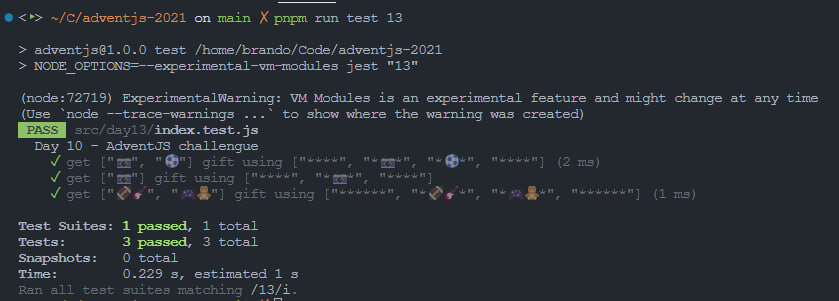

# Envuelve regalos con asteriscos

> Estamos a fuego envolviendo regalos... ¡pero necesitamos automatizar esto antes de que los elfos decidan ponerse en huelga! ¡Salva la Navidad (otra vez)!

### Solution

```javascript
export default function wrapGifts (gifts) {
  // ¡No olvides compartir tu solución en redes!
  const DECORATOR = '*'

  // define numbers and max line
  const max = gifts.at(0).length + 2

  // create line decorator
  const decorator = DECORATOR.repeat(max)

  // create lines of tree
  const lines = gifts.map(gift => DECORATOR + gift + DECORATOR)

  // create tree
  return [decorator, ...lines, decorator]
}
```

### Test

```javascript
import wrapGifts from './index'

const cases = [
  { input: ['📷', '⚽️'], expected: ['****', '*📷*', '*⚽️*', '****'] },
  { input: ['📷'], expected: ['****', '*📷*', '****'] },
  { input: ['🏈🎸', '🎮🧸'], expected: ['******', '*🏈🎸*', '*🎮🧸*', '******'] }
]

describe('Day 10 - AdventJS challengue', () => {
  test.each(cases)('get $input gift using $expected', ({ input, expected }) => {
    expect(wrapGifts(input)).toEqual(expected)
  })
})
```

### Screenshot



[Back to the table of challengues](/README.md)
