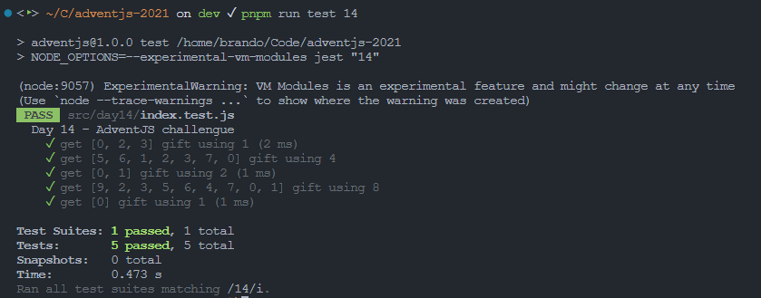

# En busca del reno perdido

> En el pueblo de Santa Claus han ido a pasear a los renos y se les ha escapado uno. ¡Madre mía! Ahora a buscarlo. 😿

### Solution

```javascript
export default function missingReindeer (ids) {
  // ¡No olvides compartir tu solución en redes!
  const size = ids.length
  const lastNumberExists = ids.some((i) => i === size)
  if (!lastNumberExists) {
    return size
  }

  const total = (size * (size + 1)) / 2
  const sum = ids.reduce((accumulator, currentValue) => accumulator + currentValue, 0)
  return total - sum
}
```

### Test

```javascript
import missingReindeer from './index'

const cases = [
  { input: [0, 2, 3], expected: 1 },
  { input: [5, 6, 1, 2, 3, 7, 0], expected: 4 },
  { input: [0, 1], expected: 2 },
  { input: [9, 2, 3, 5, 6, 4, 7, 0, 1], expected: 8 },
  { input: [0], expected: 1 }
]

describe('Day 14 - AdventJS challengue', () => {
  test.each(cases)('get $input gift using $expected', ({ input, expected }) => {
    expect(missingReindeer(input)).toEqual(expected)
  })
})
```

### Screenshot



[Back to the table of challengues](/README.md)
